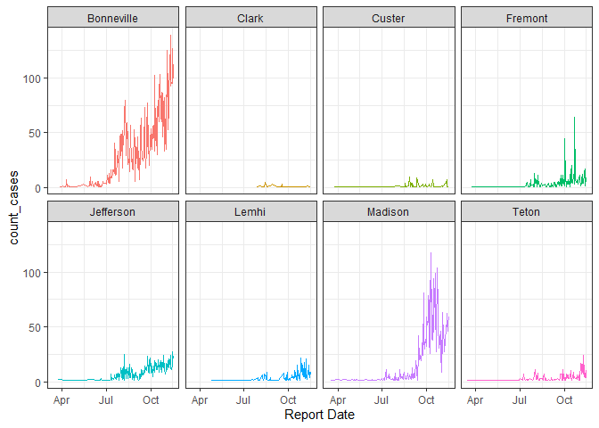
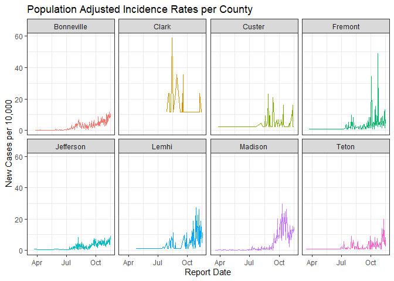
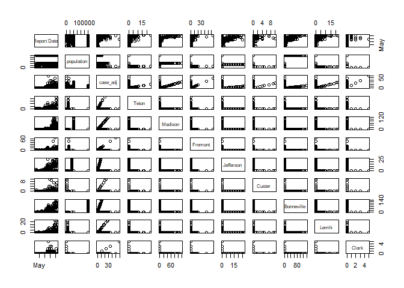
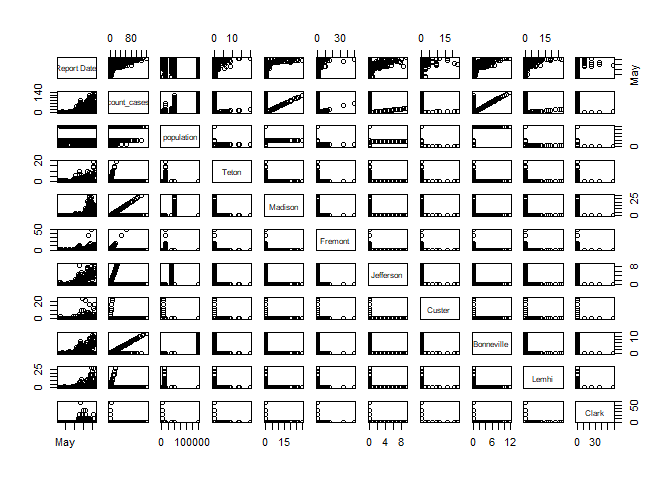
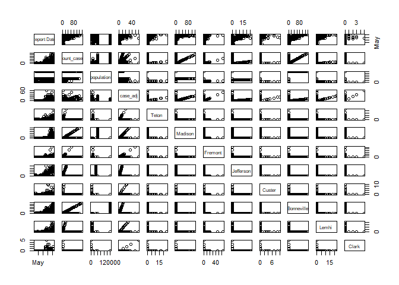
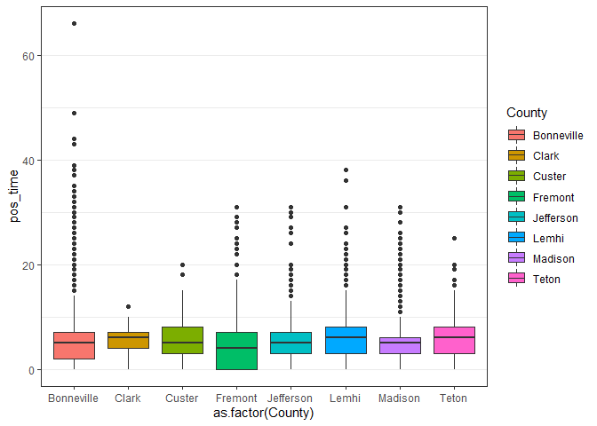
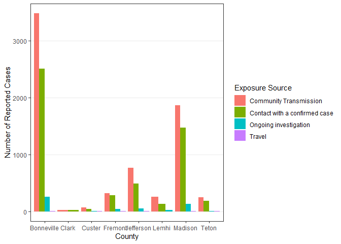
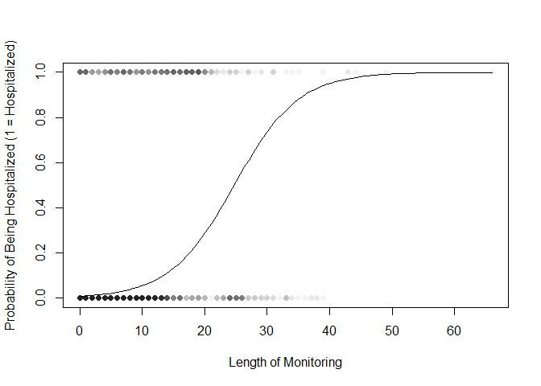
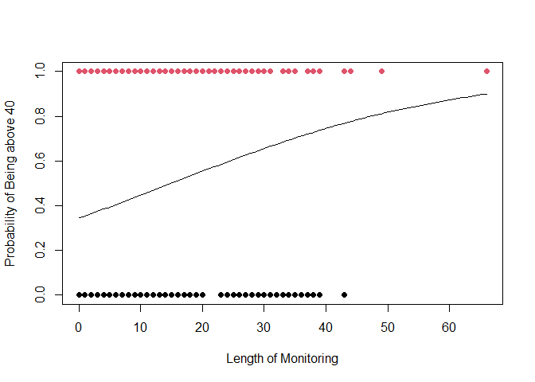
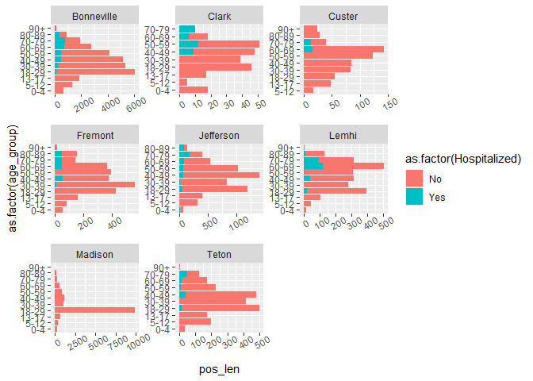

## Libraries


```r
library(tidyverse)
library(readxl)
library(pander)
library(mosaic)
library(DT)
```

## Sources

[link](https://www.idaho-demographics.com/counties_by_population)

## Read in the Data


```r
data1 <- read_xlsx("Public Records Request 11-17-2020.xlsx")
data1$County <- factor(data1$County)

#Create a population-adjusted case count per county

data2 <- data1 %>% 
  mutate(dummy_var = 1) %>% 
  group_by(`Report Date`, County) %>%
  summarise(count_cases = sum(dummy_var)) %>% 
  mutate(population = case_when(
    County == "Bonneville" ~ 119062,
    County == "Clark" ~ 845,
    County == "Custer" ~ 4315,
    County == "Fremont" ~ 13099,
    County == "Jefferson" ~ 29871,
    County == "Lemhi" ~ 8027,
    County == "Madison" ~ 39907,
    County == "Teton" ~ 12142
  )) %>% 
  mutate(case_adj = (count_cases / population) * 10000) 
```

## Let's try some ggplots


```r
ggplot(data2, aes(x = `Report Date` ,y = count_cases, color = County))+
  geom_line()+
  facet_wrap(vars(County), ncol = 4)+
  theme_bw()+
  theme(legend.position = "none")
```

<!-- -->

```r
ggplot(data2, aes(x = `Report Date`, y = case_adj, color = County))+
  geom_line()+
  facet_wrap(vars(County), ncol = 4)+
  theme_bw()+
  theme(legend.position = "none")+
  labs(y = "New Cases per 10,000",
       title = "Population Adjusted Incidence Rates per County")
```

<!-- -->

## Wide Data


```r
wide_data_cases <- pivot_wider(data2,
                         names_from = County,
                         values_from = count_cases,
                         values_fill = 0)

pairs(wide_data_cases)
```

<!-- -->

```r
wide_data_adj <- pivot_wider(data2,
                         names_from = County,
                         values_from = case_adj,
                         values_fill = 0)

pairs(wide_data_adj)
```

<!-- -->

```r
running_total_cases <- data2 %>% 
  group_by(County, `Report Date`) %>% 
  mutate(cum_sum_ever = cumsum(count_cases))

wide_running <- running_total_cases %>% pivot_wider(
  names_from = County,
  values_from = cum_sum_ever,
  values_fill = 0
)

pairs(wide_running)
```

<!-- -->

## Duration Comparisons


```r
data_rename <- data1 %>% 
  rename(
    report_date =`Report Date`,
    released_date = `Released from EIPH Monitoring`,
    age_group = `Age Group (by decade)`,
    exposure = `Source of Exposure`
  )

# Compute the amount of time spent under EIPH monitoring
# Some values were negative, but it was assumed the dates were reversed by accident.
# This was accounted for by square-rooting the square of each value.

duration_monitored <- data_rename %>% 
  mutate(total_time = difftime(released_date, report_date, unit = "days")) %>% 
  mutate(pos_time = sqrt(as.numeric(total_time)^2))

ggplot(duration_monitored,aes(x = as.factor(County), y = pos_time))+
  geom_boxplot(aes(fill = County))+
  theme_bw()+
  theme(panel.grid.major.x = element_blank())
```

```
## Warning: Removed 947 rows containing non-finite values (stat_boxplot).
```

<!-- -->

## ANOVA Test


```r
favstats(total_time~County, data = duration_monitored)
```

```
##       County min Q1 median Q3 max     mean       sd    n missing
## 1 Bonneville -30  2      5  7  66 5.014286 4.874534 5740     510
## 2      Clark   0  4      6  7  12 5.727273 3.006687   44       3
## 3     Custer   0  3      5  8  20 6.056075 4.297502  107      12
## 4    Fremont -29  0      4  7  31 4.049573 5.667373  585      49
## 5  Jefferson -30  2      5  7  31 4.886232 4.473639 1213      88
## 6      Lemhi -27  3      6  8  38 5.655080 6.182329  374      22
## 7    Madison -31  2      5  6  28 4.343016 3.975709 3236     236
## 8      Teton -25  3      6  8  20 5.408115 3.859126  419      27
```

```r
case.aov <- aov(pos_time ~ County, data = duration_monitored,
                contrasts = list(County = contr.sum))

pander(summary(case.aov))
```


----------------------------------------------------------------
    &nbsp;        Df     Sum Sq   Mean Sq   F value    Pr(>F)   
--------------- ------- -------- --------- --------- -----------
  **County**       7      1505      215      11.73    5.741e-15 

 **Residuals**   11710   214588    18.33      NA         NA     
----------------------------------------------------------------

Table: Analysis of Variance Model


## Pairwise Comparisons


```r
pairwise.t.test(duration_monitored$pos_time, duration_monitored$County, "none") %>% pander()
```

```
## Warning in pander.default(.): No pander.method for "pairwise.htest", reverting
## to default.
```


  * **method**: t tests with pooled SD
  * **data.name**: duration_monitored$pos_time and duration_monitored$County
  * **p.value**:

    ------------------------------------------------------------------------
        &nbsp;       Bonneville   Clark     Custer     Fremont    Jefferson
    --------------- ------------ -------- ---------- ----------- -----------
       **Clark**       0.4717       NA        NA         NA          NA

      **Custer**      0.05699     0.668       NA         NA          NA

      **Fremont**     0.002352    0.1232   0.002514      NA          NA

     **Jefferson**     0.7953     0.4454    0.0545     0.01389       NA

       **Lemhi**     1.293e-07    0.2777    0.3802    4.166e-10   9.443e-07

      **Madison**     1.21e-07    0.1377   0.00211     0.7278     0.001312

       **Teton**       0.1731     0.8008    0.2809    0.001692     0.1735
    ------------------------------------------------------------------------

    Table: Table continues below

    ---------------------------------------
        &nbsp;         Lemhi      Madison
    --------------- ----------- -----------
       **Clark**        NA          NA

      **Custer**        NA          NA

      **Fremont**       NA          NA

     **Jefferson**      NA          NA

       **Lemhi**        NA          NA

      **Madison**    3.209e-13      NA

       **Teton**     0.002756    0.0003587
    ---------------------------------------

  * **p.adjust.method**: none

<!-- end of list -->

## Effects


```r
dummy.coef(case.aov) %>% pander()
```

```
## Warning in pander.default(.): No pander.method for "dummy_coef", reverting to
## default.
```


  * **(Intercept)**:

    -------------
     (Intercept)
    -------------
        5.469
    -------------

  * **County**:

    ---------------------------------------------------------------------------------
     Bonneville   Clark    Custer   Fremont   Jefferson   Lemhi    Madison    Teton
    ------------ -------- -------- --------- ----------- -------- --------- ---------
      -0.2081     0.2582   0.587    -0.7733    -0.2432    0.9988   -0.7064   0.08701
    ---------------------------------------------------------------------------------


<!-- end of list -->

## Wilcoxon Rank-Sum Test


```r
kruskal.test(pos_time ~ County, data = duration_monitored)
```

```
## 
## 	Kruskal-Wallis rank sum test
## 
## data:  pos_time by County
## Kruskal-Wallis chi-squared = 96.421, df = 7, p-value < 2.2e-16
```

## Exposure vs County?


```r
#joined_data <- data1 %>% 
#  inner_join(data2, by = c(`Report Date` = `Report Date`, County = County))

exp_county <- data_rename %>% 
  group_by(exposure, County) %>% 
  summarise(count = length(ID)) %>% 
  mutate(exp = case_when(
    exposure %in% c("community Transmission", "Community Transmission", "Community TRansmission") ~ "Community Transmission",
    exposure %in% c("contact with a Confirmed Case", "Contact with a Confirmed Case", "Contact With a Confirmed Case") ~ "Contact with a confirmed case",
    exposure %in% c("Ongoing Investigation", "ONgoing Investigation") ~ "Ongoing investigation",
    exposure == "Travel" ~ "Travel"
  )) %>% 
  subset(select = -c(exposure))
```

```
## `summarise()` regrouping output by 'exposure' (override with `.groups` argument)
```

```r
ggplot(exp_county, aes(x = County, y = count, fill = exp))+
  geom_bar(stat = "identity", position = "dodge")+
  theme_bw()+
  theme(panel.grid.minor = element_blank(),
        panel.grid.major.x = element_blank())+
  labs(y = "Number of Reported Cases",
       fill = "Exposure Source")
```

<!-- -->

```r
exp_wide <- exp_county %>% pivot_wider(names_from = County,
                                       values_from = count)
```

```
## Warning: Values are not uniquely identified; output will contain list-cols.
## * Use `values_fn = list` to suppress this warning.
## * Use `values_fn = length` to identify where the duplicates arise
## * Use `values_fn = {summary_fun}` to summarise duplicates
```

```r
exp_agg <- exp_county %>% 
  group_by(County, exp) %>% 
  summarise(count_tot = sum(count))
```

```
## `summarise()` regrouping output by 'County' (override with `.groups` argument)
```

```r
exp_wide <- exp_agg %>% pivot_wider(names_from = County,
                                    values_from = count_tot,
                                    values_fill = 0)

#exp_count_table <- table(exp_wide$County, exp_wide$exp)

#pander(exp_count_table)
my_table <- as.matrix(exp_wide[,-1])

rownames(my_table) <- exp_wide[,1][[1]]
```

## Chi-Squared Test


```r
chisq.test(my_table[-4,])$expected %>% pander()
```

```
## Warning in chisq.test(my_table[-4, ]): Chi-squared approximation may be
## incorrect
```


--------------------------------------------------------------------------------
           &nbsp;             Bonneville   Clark   Custer   Fremont   Jefferson 
---------------------------- ------------ ------- -------- --------- -----------
 **Community Transmission**      3464      26.08   65.47     350.7      720.2   

 **Contact with a confirmed      2528      19.03   47.77     255.8      525.5   
           case**                                                               

 **Ongoing investigation**      251.8      1.896   4.759     25.49      52.35   
--------------------------------------------------------------------------------

Table: Table continues below

 
------------------------------------------------------
           &nbsp;             Lemhi   Madison   Teton 
---------------------------- ------- --------- -------
 **Community Transmission**   219.7    1924     245.2 

 **Contact with a confirmed   160.3    1404     178.9 
           case**                                     

 **Ongoing investigation**    15.97    139.9    17.83 
------------------------------------------------------


## Hospitalization and length of Supervision? Logistic Regression Model


```r
len_hosp <- data_rename %>% 
  mutate(length_hosp = difftime(released_date, report_date, unit = "days")) %>% 
  mutate(pos_len = sqrt(as.numeric(length_hosp)^2))


len_glm <- glm(formula = (Hospitalized == "Yes") ~ pos_len, data = len_hosp, family = "binomial")
summary(len_glm)
```

```
## 
## Call:
## glm(formula = (Hospitalized == "Yes") ~ pos_len, family = "binomial", 
##     data = len_hosp)
## 
## Deviance Residuals: 
##     Min       1Q   Median       3Q      Max  
## -2.3769  -0.2528  -0.2089  -0.1567   3.0951  
## 
## Coefficients:
##             Estimate Std. Error z value Pr(>|z|)    
## (Intercept) -4.78141    0.09259  -51.64   <2e-16 ***
## pos_len      0.19347    0.00795   24.34   <2e-16 ***
## ---
## Signif. codes:  0 '***' 0.001 '**' 0.01 '*' 0.05 '.' 0.1 ' ' 1
## 
## (Dispersion parameter for binomial family taken to be 1)
## 
##     Null deviance: 3461.3  on 11717  degrees of freedom
## Residual deviance: 2834.7  on 11716  degrees of freedom
##   (947 observations deleted due to missingness)
## AIC: 2838.7
## 
## Number of Fisher Scoring iterations: 6
```

```r
b <- coef(len_glm)

plot(formula = (Hospitalized == "Yes") ~ pos_len, data = len_hosp, pch = 16, col = rgb(.1,.1,.1,.05), xlab = "Length of Monitoring", ylab = "Probability of Being Hospitalized (1 = Hospitalized)")

curve(exp(b[1] + b[2]*x)/(1+exp(b[1]+b[2]*x)), add = TRUE)
```

<!-- -->

```r
library(ResourceSelection)
```

```
## ResourceSelection 0.3-5 	 2019-07-22
```

```r
hoslem.test(len_glm$y, len_glm$fitted, g = 30)
```

```
## 
## 	Hosmer and Lemeshow goodness of fit (GOF) test
## 
## data:  len_glm$y, len_glm$fitted
## X-squared = 134.58, df = 28, p-value = 6.661e-16
```

## Hospitalization and Length


```r
sex_length_glm <- glm(formula = (Sex == "F") ~ pos_len, data = len_hosp, family = "binomial")
summary(sex_length_glm)
```

```
## 
## Call:
## glm(formula = (Sex == "F") ~ pos_len, family = "binomial", data = len_hosp)
## 
## Deviance Residuals: 
##    Min      1Q  Median      3Q     Max  
## -1.335  -1.196   1.122   1.159   1.174  
## 
## Coefficients:
##             Estimate Std. Error z value Pr(>|z|)  
## (Intercept) 0.007281   0.028889   0.252   0.8010  
## pos_len     0.007275   0.004316   1.685   0.0919 .
## ---
## Signif. codes:  0 '***' 0.001 '**' 0.01 '*' 0.05 '.' 0.1 ' ' 1
## 
## (Dispersion parameter for binomial family taken to be 1)
## 
##     Null deviance: 16239  on 11717  degrees of freedom
## Residual deviance: 16236  on 11716  degrees of freedom
##   (947 observations deleted due to missingness)
## AIC: 16240
## 
## Number of Fisher Scoring iterations: 3
```

```r
#insignificant p-values, no need to plot
```

## Length and Age Group


```r
table(len_hosp$age_group)
```

```
## 
##   0-4 13-17 18-29 30-39 40-49  5-12 50-59 60-69 70-79 80-89   90+ 
##   209   777  4250  1886  1824   493  1424   995   554   218    35
```

```r
# Create a column classifying those form 0-39 as 0 and those from 40-90 as 1
two_age_groups <- len_hosp %>% 
  mutate(age_group_2 = case_when(
    age_group %in% c("0-4", "5-12", "13-17", "18-29", "30-39") ~ 0,
    TRUE ~ 1
  ))

age_glm <- glm(formula = (age_group_2 == 1) ~ pos_len, data = two_age_groups, family = "binomial")

summary(age_glm)
```

```
## 
## Call:
## glm(formula = (age_group_2 == 1) ~ pos_len, family = "binomial", 
##     data = two_age_groups)
## 
## Deviance Residuals: 
##     Min       1Q   Median       3Q      Max  
## -1.7118  -1.0024  -0.9361   1.3441   1.4589  
## 
## Coefficients:
##              Estimate Std. Error z value Pr(>|z|)    
## (Intercept) -0.641012   0.030134 -21.272   <2e-16 ***
## pos_len      0.042871   0.004481   9.566   <2e-16 ***
## ---
## Signif. codes:  0 '***' 0.001 '**' 0.01 '*' 0.05 '.' 0.1 ' ' 1
## 
## (Dispersion parameter for binomial family taken to be 1)
## 
##     Null deviance: 15744  on 11717  degrees of freedom
## Residual deviance: 15649  on 11716  degrees of freedom
##   (947 observations deleted due to missingness)
## AIC: 15653
## 
## Number of Fisher Scoring iterations: 4
```

```r
b1 <- coef(age_glm)

plot(formula = (age_group_2 == 1) ~ pos_len, data = two_age_groups, pch = 16, col = as.factor(age_group_2), xlab = "Length of Monitoring", ylab = "Probability of Being above 40")

curve(exp(b1[1] + b1[2]*x)/(1+exp(b1[1]+b1[2]*x)), add = TRUE)
```

<!-- -->


```r
len_hosp <- len_hosp %>% 
  mutate(age_group = factor(age_group, levels = c("0-4", "5-12", "13-17", "18-29", "30-39", "40-49", "50-59", "60-69", "70-79", "80-89", "90+"))) %>% 
  mutate(Hospitalized = case_when(
    Hospitalized == "Yes" ~ "Yes",
    TRUE ~ "No"
  ))
```


```r
ggplot(len_hosp, aes(x = as.factor(age_group), y = pos_len, fill = as.factor(Hospitalized)))+
  geom_bar(position = "stack", stat = "identity")+
  facet_wrap(vars(County), scales = "free")+
  theme(axis.text.x = element_text(angle = 30))+
  coord_flip()
```

```
## Warning: Removed 947 rows containing missing values (position_stack).
```

<!-- -->

```r
#library(rnoaa)

#vignette("rnoaa")

#options(noaakey = "ETJJubDnGOQeIsueSktTGtoOAJBssfnw")

#weather_data <- ncdc_locs(locationcategoryid = "CITY", sortfield = "name", sortorder = "desc")

#eiph_cities <- ncdc_locs(locationcategoryid = "CITY", sortfield = "name", sortorder = "desc") %>% 
#  filter(name == "Rexburg, ID US")
#str(weather_data)

#grep("ID", weather_data$data$name, value = TRUE)
```


```r
library("devtools")
```

```
## Loading required package: usethis
```

```r
install_github("Ram-N/weatherData")
```

```
## WARNING: Rtools is required to build R packages, but is not currently installed.
## 
## Please download and install Rtools 4.0 from https://cran.r-project.org/bin/windows/Rtools/.
```

```
## Skipping install of 'weatherData' from a github remote, the SHA1 (4326bdc0) has not changed since last install.
##   Use `force = TRUE` to force installation
```

```r
library(weatherData)
weather_data <- checkDataAvailabilityForDateRange("KIDA", "2020-01-01", "2020-11-20")
```

```
## Getting data from:
##  https://www.wunderground.com/history/airport/KIDA/2020/1/1/DailyHistory.html?format=1
```

```
## URL does not seem to exist: https://www.wunderground.com/history/airport/KIDA/2020/1/1/DailyHistory.html?format=1
```

```
## The original error message:
```

```
## Warning in getDetailedWeather(station_id, start_date, station_type, opt_temperature_columns = T, : Unable to get data from URL
##  Check if URL is reachable
```

```
## Getting data from:
##  https://www.wunderground.com/history/airport/KIDA/2020/11/20/DailyHistory.html?format=1
```

```
## URL does not seem to exist: https://www.wunderground.com/history/airport/KIDA/2020/11/20/DailyHistory.html?format=1
```

```
## The original error message:
```

```
## Warning in getDetailedWeather(station_id, end_date, station_type, opt_temperature_columns = T, : Unable to get data from URL
##  Check if URL is reachable
```

```
## Checking Data Availability For KIDA
```

```
## Found 0 records for 2020-01-01
```

```
## Found 0 records for 2020-11-20
```

```
## Data is Not Available
```

```r
getDetailedWeather("KIDA", "2020-01-01", "id", 
        opt_temperature_columns = T, opt_compress_output = T, 
        opt_verbose = T)
```

```
## Getting data from:
##  https://www.wunderground.com/weatherstation/WXDailyHistory.asp?ID=KIDA&month=1&day=1&year=2020&format=1
```

```
## URL does not seem to exist: https://www.wunderground.com/weatherstation/WXDailyHistory.asp?ID=KIDA&month=1&day=1&year=2020&format=1
```

```
## The original error message:
```

```
## Warning in getDetailedWeather("KIDA", "2020-01-01", "id", opt_temperature_columns = T, : Unable to get data from URL
##  Check if URL is reachable
```

```
## NULL
```


### Geofacet per county of the progression of disease prevalence


```r
#library(geofacet)
#ggplot(data2, aes(x = `Report Date`, y = case_adj))+
#  facet_geo(vars(County))
```
